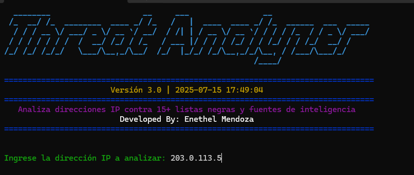
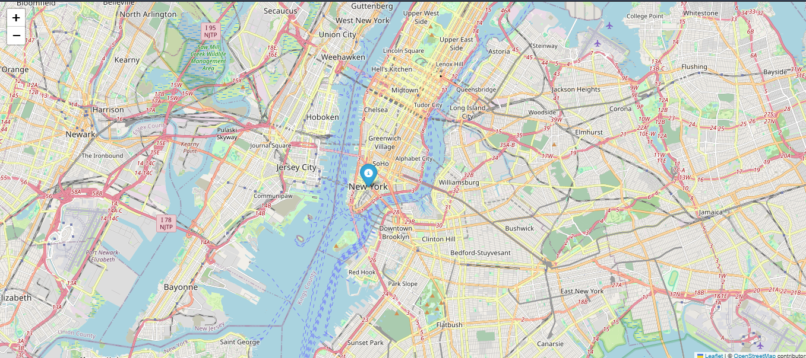
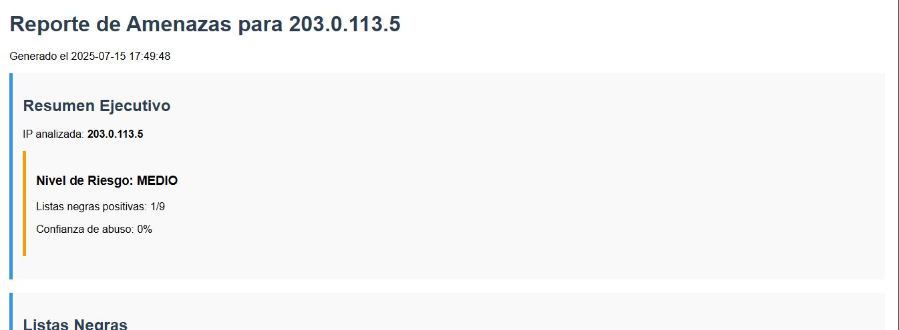

## 📊 Banner del Analizador



# 🛡️ Threat Analyzer - Informe de Inteligencia de IP

Este script en Python realiza un análisis completo de una dirección IP, cruzando información de múltiples fuentes públicas y privadas para determinar su nivel de riesgo, reputación y geolocalización. Incluye visualizaciones, mapas y reportes HTML interactivos.

---

## 📌 ¿Qué hace?

- Valida si una IP es válida.
- Consulta más de 10 listas negras (DNSBL).
- Obtiene geolocalización combinada desde:
  - ip-api.com
  - IPWhois
  - ipinfo.io (requiere API)
- Analiza historial de amenazas en:
  - AbuseIPDB
  - VirusTotal (requiere API)
  - Shodan (requiere API)
- Obtiene datos WHOIS detallados.
- Genera visualizaciones con matplotlib.
- Muestra mapas interactivos con folium.
- Crea reportes HTML visuales y profesionales.

---

## 🧰 Requisitos

Asegúrate de tener instalados los siguientes paquetes:

```bash
pip install -r requirements.txt
```

Contenido del archivo `requirements.txt`:

```
dnspython
requests
jsonlib
pyfiglet
termcolor
folium
ipwhois
pandas
matplotlib
```

---

## 🛠️ Uso

1. Configura tus claves de API opcionales en la clase `Config`.
2. Ejecuta el script:
```bash
python threat_analyzer.py
```
3. Ingresa la IP a analizar cuando se solicite.
4. Revisa el reporte generado (HTML) y el mapa si hay ubicación.

---

## 📂 Salida

- Reporte en HTML con todo el análisis.
- Mapa en HTML de la ubicación.
- Imágenes de los gráficos generados.

---

## 👤 Autor

**Enethel Mendoza**

---

## ⚠️ Advertencia

Este script es con fines educativos y de análisis. No debe utilizarse para actividades ilegales ni intrusivas.

---

## 📝 Licencia

Código libre para uso personal o académico. Menciona al autor si lo compartes.


## 🗺️ Mapa de Geolocalización


## 📝 Reporte Generado
